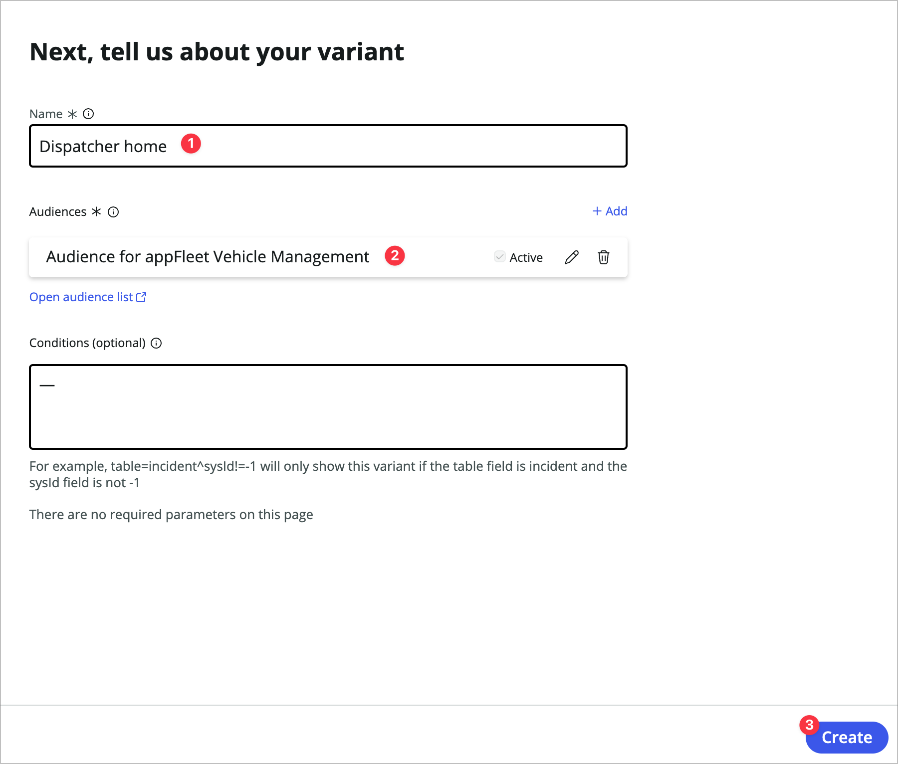
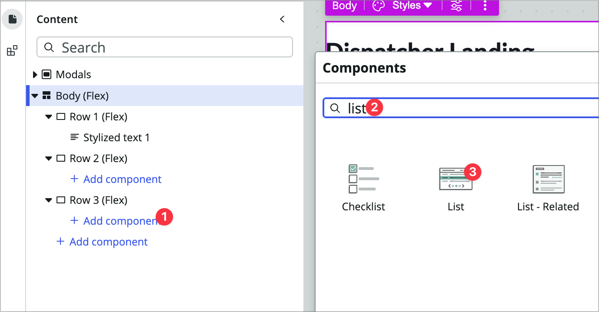
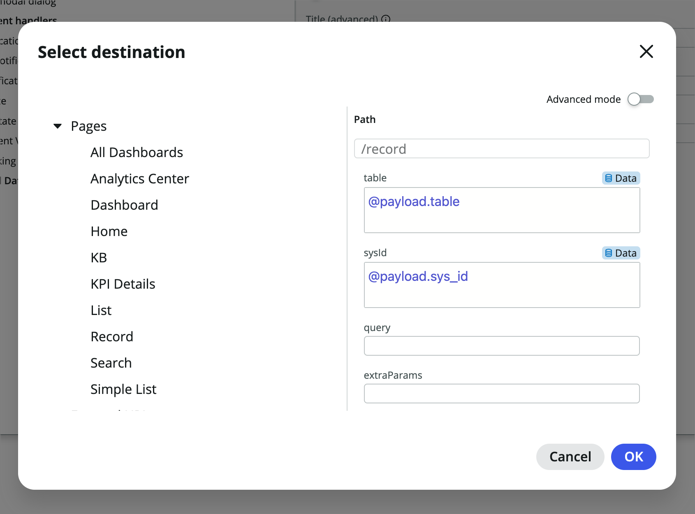
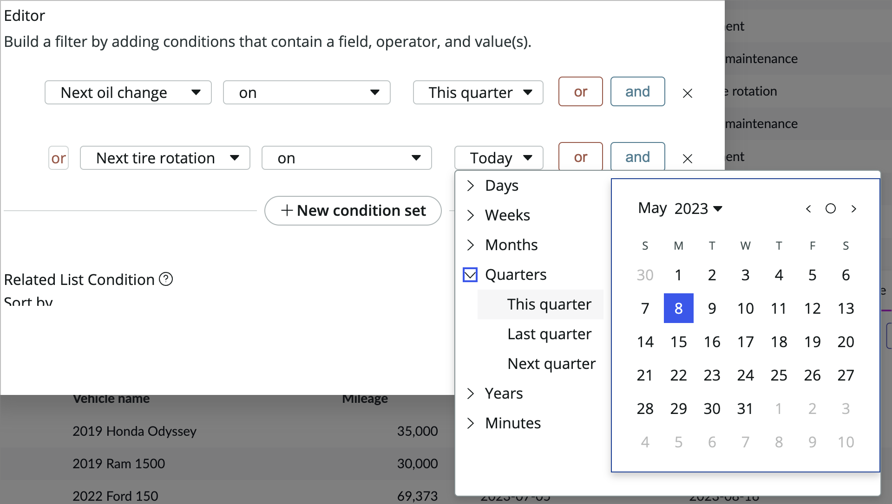
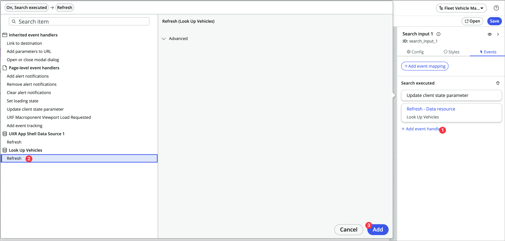
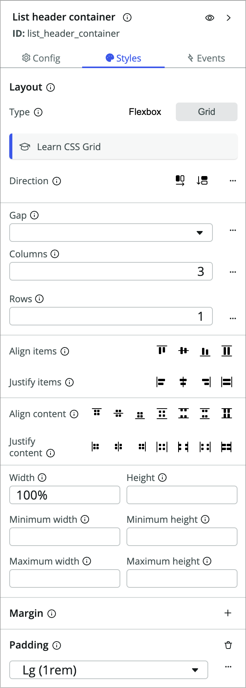
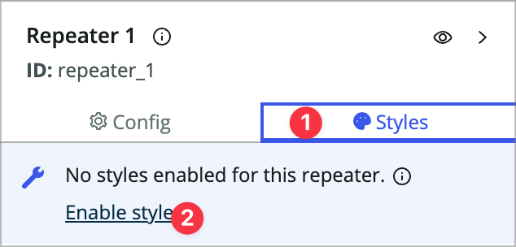
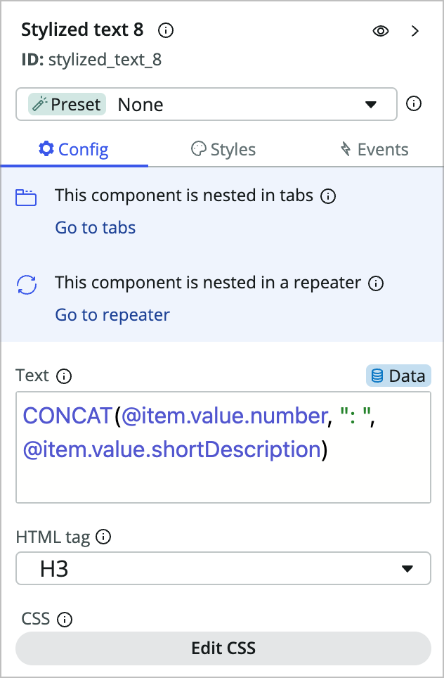
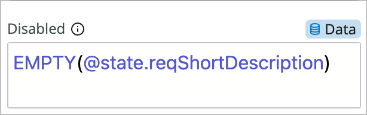
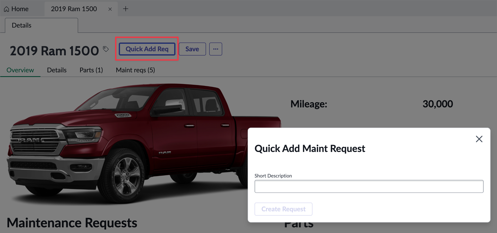

# Building a Killer Workspace Experience with UI Builder

## Goal

In this lab you will learn how to use UI Builder to build and configure a workspace for a custom application. You will start with a prebuilt application to manage a company's fleet of vehicles.

You will use UI Builder to open a starter workspace experience created from App Engine Studio to build out the fulfiller workspace experience to make it easier to interact with the application and make your fulfillers more productive. This lab will touch on a number of different parts of UI Builder while you create the custom experience including but not limited to:

* Creating lists
* Creating new pages
* Page parameters
* Data resources
* Client state parameters
* Client scripts
* Configuring components
* Using the repeater component
* Updating ServiceNow records from the experience
* Working with the Standard Record Page template

## Lab Objective

The primary objective of this lab is to expose you to the different parts of configuring and customizing a workspace. A very basic fleet vehicle management workspace exists in your instance and you will configure it similarly to how you would configure one of ServiceNow's default workspaces.

## (Optional) Pre-flight check

If you're doing this lab during CreatorCon, you'll be working on an instance on NowLearning loaded with the FLeet Vehicle Management application. If you're following along with this lab guide on a Personal Developer Instance (PDI), please follow the instructions in the Appendix at the end of this lab guide to learn how to pull in the Fleet Vehicle Management application.

# Exercise 1 - Basic Workspace Configuration

## Explore the base version of the app

1. First, switch to the *Fleet Vehicle Management* scope by clicking the globe icon in the header (5th icon from the right), click **Applications**, then find and click the **Fleet Vehicle Management** scope. 

    **Note:** You can also switch scope from within UI Builder.

    

2. In your instance, go to **Workspaces \> Fleet Vehicle Management**.

    You'll notice that the homepage is very generic and doesn't really fit our requirements, so you'll be adding a new variant and customizing that. 

3. Click on the list icon in the L1 menu on the left.

    

    > Notice that the lists that come up on the left could be organized better, which we'll do.

4. There are four primary tables associated with the app.

   * Vehicle
   * Maintenance requests
   * Maintenance tasks
   * Parts

5. Click into one of the requests.

    > You'll notice the form that comes up just has the two tabs so we'll be enhancing that as well.

## Open the Workspace in UI Builder

1. In the top menu in your instance, which we'll call the *Classic Environment* tab, click **All**, type *UI Builder* into the filter, and click **UI Builder** to launch it in a new tab.

    

2. Open the workspace by clicking on **Fleet Vehicle Management** under *Experiences*. You may have to do some sorting or show more rows per page.

  > This will open the experience in UI Builder's experience view. The experience view gives you a holistic view of your experience with all of the pages and homepages associated with your experience.

## Consolidate lists

In this section you'll do some consolidating of the lists in the workspace.

1. In the experience view choose the **List default** variant to open the list page in UIB.

    

2. On the left side of the page you'll see the Content panel with the content tree. In the content tree, click on the **List nav** component to select it.

    

3. You'll see the config panel on the right side of your UIB page. This is where each component can be configured by setting its properties, styles, and events. Choose the **Configuration** link at the bottom. This will open the UX List Menu Configurations in a new tab. 

    
   
4. Choose **Fleet Vehicle Management_menu_config** to open the list configuration for this workspace experience.

5. In the related lists you'll see the 7 default menu categories and the 13 default lists. 

6. Use the **New** button to create a new UX List Category.

    

7. Give it the following values and choose **Submit**:

    * Title: Administration
    * Order: 1000

    

8. You should be back looking at the UX List Categories related list. In that related list, click into **Maint req**, edit the following, and click **Update**:

    * Name: Maintenance Requests

9.  Click into **Maint task**, edit the following, and click **Update**:

    * Name: Maintenance Tasks
    * Order: 200

10. Open the Vehicle item, rename it to **Vehicles**, set the order to 300, and click **Update**.

11. Now, click into the **UX Lists** tab.

    

1. Find the UX List record for the *Part* table. Double click in the *Title* list cell next to *All*.

    

1. Rename it from *All* to **Parts**.

    

1. On the same record, use list editing to change its *Category* from *Part* to **Administration**.

2.  Now use list editing the same way you did previously to change the *Category* of each of the following UX Lists to **Administration** and the titles to match their table names:

    * Part reference
    * Manufacturers
    * Models

    It should look like this when you're done (I filtered out the other lists):

    

3.  Now switch back to the classic environment tab (with the all menu), go back to the list view (go to the fleet management workspace and click the list icon on the left menu) for the workspace from the previous exercise and do a browser refresh. You should see the new list structure.

## Configure the form

Now you'll do some form configuration. Since there is only one form view for our maint req table we don't have to worry about which form view we're using. If you're confgiuring the incident table or another table with multiple views you'll need to make sure you're editing the view that's being shown in the workspace. This generally set in the UX Page Properties for the experience, but could work differently in different workspaces.

1. If you still have the list page open in your UI Builder tab, use the dropdown at the top to switch to the **Record page**. If you don't see the UI Builder preview for the page click the **Editor** pill at the top.

    

2. Click **Open** at the top right to open the page in runtime in a new tab for testing. You'll see that it's missing the activity stream component and email functionality. Let's add it.

    

3. Back in your UI Builder tab, find and click on the **Form** component in the content tree on the left.

    

4. In the config panel on the right, scroll down to the bottom abd click **Edit form view** to open form builder in a new tab.

    > You may see *undefined* in place of actual field names on the form, which is a bug in the current version of form builder. Lucky for us, it really only matters that you add things to the form, not where they are on the form.

5. At the top left, click **More** and choose **Formatters**.

    

6. Drag the **Activities (filtered)** formatter to the bottom of the form and choose **Save**.

    

7. Go back to the browser tab where the rendered record page is showing and hit refresh. You'll see that the activity stream now shows up on the right.

    > Note that there is a check on the workspace side of things that checks to see if the activity formatter is present and then shows the acitivty stream component if so. It doesn't matter where you add the activity formatter in table builder, it will always show in the same place on the UIB page unless you edit the UIB page and move it.

8. Notice that only work notes is accessible in the page. Go back to the form builder tab and add the additional comments field above the activities formatter.

    

9.  Click **Save** and refresh the rendered workspace tab. You should now see the ability to post work notes and comments.

10. Now let's add email capabilities to the form. In form builder click **Preview** (at the top right next to *Save*).

    

11. In the view that comes up click **Open form in Platform** at the very top right.

12. Right click on the form header and choose **Configure > Dictionary**.

  

13. Choose the dictionary entry without a column name where Type is Collection.

    

14. Click **Advanced view** under Related Links.

    

15. In the Attributes field add **email_client=true** and choose **Update** to save your changes.

    

16. In your rendered workspace tab refresh and choose the horizontal three dots menu to the right of the **Save** button. You should now see a *Compose Email* option.

    

# Exercise 2 - Enhance the experience home page

In this exercise you'll make a variant of the home page for a dispatcher persona that shows information about vehicles and allows the dispatcher to easily create requests. If you're working with one of the 20+ workspaces we ship by default, you'll notice that all of the pages associated are read only. If you want to change the appearance of the page you can create a variant of that page. You can duplicate the existing page or start from scratch, and we'll start from scratch here.

## Create a variant

A page variant in UI Builder is a variation of a page that exists at the same path that targets different audiences. Every page has a default variant.

1. In UI Builder, go to the experience view for your Fleet Management Experience. If you're already in UIB, click Fleet Vehicle Management next to the UIB logo at the left of the builder window.

    

2. Click on the plus sign next to Pages and variants.

    

3. Choose **Add variant to page**.

4. Choose **+Add variant** under *Home default*.

    

5. Choose **--> Create from scratch instead**.

    

6. Name it **Dispatcher home**.

7. Under *Audience* Click **+Add** anmd choose **Audience for appFleet Vehicle Management** and click **Create**.

    

    > Notice that the order of this variant is 0 so it will show up first. 

8. Click the **Editor** link for the *Dispatcher home* variant to open it in UIB.

    

## Add components to the page

1. Click **+Add component** under *Body (flex)* in the content tree to bring up the component toolbox.

    

2. Search for and choose **Container**.

    

3. Now you'll rename this container. I don't always rename components, but renaming containers is generally a good idea, especially when there will be more than a few on the page. On the right side of the builder window, in the configuration panel, click the **(i)** icon next to the name of the container.

    

4. Give it a label of **Row 1** and an ID of **row_1** and click **Apply**.

    

5. Right-click on Row 1 (Flex) in the content tree and choose **Duplicate** or CMD/CTRL+D to duplcate the container.

    

6. Rename the new container **Row 2** and **row_2**.

7. Now add a **Row 3** after *Row 2* the same way and **Save** your page (CMD/CTRL+S works for this). The content tree should look like this.

    

8. Now add a **Stylized text** component in *Row 1*.

    

9. In the config panel on the right, choose **None Configure the component manually.**

    

    > Afer selecting the None option you'll see this component's three properties. Each component has a set of properties, which are the component inputs you can configure in UI Builder.

10. In the *Text* property, enter: **Dispatcher Landing**. You'll leave the HTML tag and CSS properties as is.

<!-- This looked bad so we're doing one on top of the other

11. Now click on **Row 3 (flex)** in the content tree.

12. In the styles panel choose **Grid** for the *Type* and fill out:

    * Gap: **Lg (1rem)**
    * Columns: **2**
    * Rows: **1**

-->

1.  Now add a **List** component to the Row 3 container. 

    
   
2.  Rename the list component:

    * Label: Request List
    * ID: request_list

    

3.  In the config panel, configure as follows:

    * Table: **Maint req**
    * Columns: (use the **+Add** button on this property to add each field one at a time) **number | vehicle | mileage | state | short_description**
    * Edit filter: **State | is one of | Pending, Open, Work in Progress**
    * Title: **Active Maintenance Requests**
    * Hide list actions: **true**
    * Pagination \> Maximum rows: **10**

4.  Click the **Events** tab of the configuration panel on the right, choose **+ Add event mapping**, and choose **Reference link clicked**.

    

5.  In the modal that comes up choose **Link to destination** under *Inherited event handlers* and choose the **Select destination** button.

    

6.  Expand the *Pages* dropdown, and choose **Record**.

7.  Now you'll need to pass in dynamic data to the event handlers properties. Mouse over the *table* property and click the **Bind data** icon.

    

8.  Set the value to **@payload.table**

9.  Do the same with the sysId property and set the value to **@payload.sys_id**.

10. Choose **OK**.

    

11. Click **Add** to add the event handler to the event.

12. **Save** the page and use the **Open** button to preview the page in a new tab. Both the requests and vehicle links should open the appropriate records.

    

    > The links should open those records in a new workspace tab. Also notice the pagination and filtering that come along with this highly configurable component.

13. Go back to the UI Builder tab.

14. Now right-click on the **Request List** component in the content tree and choose **Duplicate**.

15. Rename the component **Vehicle List** and **vehicle_list**.

16. Configure the component as follows:

    * Table: **Vehicle**
    * Columns: **number | vehicle_name | mileage | next_oil_change | next_tire_rotation**
    * Edit filter: **Next oil change | on | This quarter OR Next tire rotation | on | This quarter**
    
    * Title: **Vehicles this quarter**
    * Pagination \> Maximum rows: **20**

17. **Save** and test the page. 

    > Do the links work? They should work similarly to the previous list because the event handlers copied over when you duplicated the list. Because we kept them dynamic they'll also work with the new list.

## Add vehicle search box

Now you're going to add a vehicle search to the homepage so the dispatcher can easily search vehicles by name or license plate.

1. In your UI Builder tab, inside the empty *Row 2* container, add another **Container** component and rename it **Search container**.

    > You'll notice we're doing a lot of renaming. The main reason for this is to make life easier on yourself when you or someone else comes back to this page in 6 months and needs to change something in a complex content tree. Renaming makes it easier to target specific components and know their original purpose. You can think of component renaming as a form of documentation.

2. Add another container by right-clicking on the Search container and choosing **Add component after**. Call it **Vehicle container**. Your Row 2 container should look like this in the content tree at this point:

    

3. Open the client state parameter panel by clicking the **Client state** icon in the bottom left corner of the builder window.

    

    > Client state parameters are a mechanism you can use to manage the page's state. You can think of these as the page's scratchpad where you can store values to be used elsewhere on the page.

4. Use the **+Add** button to add a new client state parameter:

    * Name: searchTerm
    * Type: String
    * Initial value: <empty>

    

5. Now you'll add a search component and set the client state parm value when someone searches. Inside the *Search container* add a **Search input** component and set its Placeholder property to **Search vehicles**.

    

6. Click into the *Events* tab, choose **+Add event mapping**, and then choose **Search executed**.

    

7. On the left, under *Page-level event handlers* choose **Update client state parameter** and fill out the form:

    * Client State Parameter Name: searchTerm
    * New Value: (change to dynamic data binding) @payload.searchTerm

    

8. Click **Apply**.

9.  You're going to display search results inside the Vehicle container, but first you're going to show/hide that container based on whether the searchTerm parameter is empty or not. Click on the **Vehicle container (flex)** in the content tree.

10. In the config panel for the container on the right, there is a very small eye icon at the top right of the panel that toggles the component visibility properties. Click it.

    

11. Mouse over the *Hide component* property and switch to dynamic data binding.

    

12. Now, you'll use a formula in that property. Enter **EMPTY(@state.searchTerm)**. 

    

    > This formula returns true/false based on whether the *searchTerm* client state parameter is empty or not.

13. **Save** the page and open the preview/runtime. 

14. Type something into the search box and hit enter. You should see the container show up with the no contents displayed error message once you execute a search.

## Add vehicle search results

Now you'll configure the search results. You're going to use a data resource and repeater rather than another list component to expose a different method of showing a list of records. 

1. First you'll need a data resource. Click the data icon at the bottom left of the page.

    

    > For more information on data resources, you can check out my [All About Data Resources in UI Builder](https://www.servicenow.com/community/next-experience-articles/all-about-data-resources-in-ui-builder/ta-p/2360643) article. Data resources allow you to query and mutate data from the server so your components don't have to worry about data handling.

1. In the Data panel that comes up, choose **+Add**, search for **look up records**, choose the **Look up records** data resource and click **Add**.

    

2. Fill out the data resource as follows:

    > Note that it's going to tell you something is wrong. This is because the data resource hasn't been configured yet. You haven't done anything wrong!

    * Use the (i) to change the label to **Look Up Vehicles** and the ID to **look_up_vehicles**.
    * When to evaluate this data resource: **Only when invoked (explicit)**
    * Table: **Vehicle**
    * Edit conditions: **Vehicle name | contains | <ddb> @state.searchTerm** OR **License plate | contains | <ddb> @state.searchTerm** (You'll need to toggle to data binding for the values)
    * Return fields: **Vehicle name | license_plate**
    * Order by: **Vehicle name**
    * Max results: **10**

    

3. Since you selected that the data resource is only evaluted when invoked, you'll need to trigger a refresh when someone searches. Click into the **Search input 1** component, click on its events tab, and add another event handler to the *Search executed* event.

4. Under *Look up vehicles* choose **Refresh** and click **Add**.

    

1. Now so you can see what's happening in the preview panel, click into the **Vehicle Container** and set the *Test value* property to **false**. This allows you to keep the formula that hides the component, but allows you to see what you're configuring.

    

2. Now add a new container component within the *Vehicle container* and set it to:

    * Component label: (click the i icon) **List header container**
    * Type: **Grid**
    * Columns: **3**
    * Rows: **1**
    * Padding: **Lg (1rem)**

    

3. Add a stylized text component within the container component and fill it out:

    * Presets: **None**
    * Text: **Vehicle name**
    * HTML tag: **H2**

4. Duplicate the stylized text component you just added and set the text to **License plate**.

5. Right-click **List header container (Grid)**, choose add component after, and add a **Repeater** component.

    

6.  In the Repeater's config panel, change the *Data array* property to dynamic data binding and enter: **@data.look_up_vehicles.results**. You should see a little green 10 next to the repeater component in the content tree since you're returning 10 results from the data resource.

    

7.  Add another **Container** inside the repeater calling it **List container** and styling it the same as the *List header container* from the last step.

    * Type: **Grid**
    * Columns: **3**
    * Rows: **1**
    * Padding: **Lg (1rem)**

8.  Within that *List container* add a stylized text component with the following values:

    * Presets: **None**
    * Text: **@item.value.vehicle_name.value** (switch to data binding)
    * HTML tag: **H4**

    > @item.value targes the item in the array from the repeater. Note that the repeater is only showing you the first result in the preview panel, even though you can see there are 10 results on the left. This is both for performance reasons and to reduce clutter on the page.

9.  Duplicate that stylized text component to another and give it text of: **@item.value.license_plate.value**. Note that you'll need to click into the new component after you duplicate.

10. Add a **Button** component after the stylized text component and set its *Label* to **Create New Maint Request**.

11. Click into the *Styles* tab and set *Padding* to **Lg (1rem)**.

12. In the *Events* tab add a new event handler to the *Button clicked* event.

13. Choose **Link to destination** and change the *Mode* from *Form* to **Script**.

    

14. You'll paste the following script from [Exercise2.txt](files/Exercise2.txt):

    ```javascript
    /**
    * @param {params} params
    * @param {api} params.api
    * @param {any} params.event
    */
    function evaluateEvent({api, event}) {
        return {
            route: 'record',
            fields: {
                'table': 'x_snc_flt_mgmt_maint_req',
                'sysId': -1
            },
            params: {
                'query': 'vehicle=' + api.item.value._row_data.uniqueValue
            },
            redirect: null,
            passiveNavigation: null,
            title: null,
            multiInstField: null,
            targetRoute: null,
            external: null
        };
    }
    ```

    > You're using a script for this in order to build the query param. You can pass a query to the record page to prepopulate values, similar to the classic environment. In this script you're linking to the record page with a sys_id of -1, which means you're populating a new record.

15. Click **Add**. 

16. Click back into **Vehicle Container (Flex)** and set the *Test value* back to **None**.

17. **Save** the page and open it in the runtime to test. Search for a Ford Mustang and click the **Create New Maint Request** button. It should open the request in a new tab while prepopulating the vehicle record in the request.

This isn't the prettiest page in the world, and maybe even isn't all that practical, but hopefully it gives you an idea of some of what you can accomplish on a landing page like this. 

# Exercise 3 - Enhance the Record Page for Vehicles

The next requirement is to customize the vehicle record page and give it an overview tab. Right now there is just one generic record page variant, so you'll create a new variant specifically for vehicles and edit that.

## Create a variant for Vehicles

1. Using the page picker dropdown, open the **Record** variant of the record page.

    

2. Use the hamburger icon at the top left of the page and choose **Duplicate variant**.

    

3. Name it **Vehicle Record**, set the conditions to **table=x_snc_flt_mgmt_vehicle**, and choose **Create**.

    > In the conditions the text mentions 'fields', but it's really talking about required url parameters. Since you're passing table and sys_id to the page through the URL you can use those params to make a decision on which variant is served up.

    

4. Click the flask icon at the top left of the builder window and set new test values:

    * table: **x_snc_flt_mgmt_vehicle**
    * sysId: **fef6b31a1b3819101363ff37dc4bcb9a**

5. Click **Apply**.

    

    > You should see the vehicle change to 2019 Ram 1500.

6. **Save** the page.

7. Click the **Settings** toggle at the top of the builder window, change the *Order* to **-10**, and **Save**.

    

## Add an overview tab to the variant

Now you'll add an overview tab to this page showing an overview of the record so you don't need to click into the details or related lists unless something needs to be updated.

1. Click back into the **Editor** toggle.

1. In the content tree, click **Main Tab**.

1. In the Config panel, click **+Add** next to the Tabs property.

    

1. Choose **Start from an empty container** and click **Next**.

    > If this was a tab we wanted to reuse on another page we might use a page collection instead which allows you to create a subpage which can be used in other tabsets.

2. Label it **Overview**, choose **No icon**, and click **Create**.

    

3. Back in the Config panel of the Main Tab component use the 2x3 vertical dots icon to drag the **Overview** tab above the *Details* tab.

    

4. In the content tree on the left, click **Overview (Flex)** and in its *Styles* tab set *Padding* to **Lg (1rem)**
   
5. Add a new container component to the *Overview (Flex)* tab under the *Main Tab* and label it **Vehicle Info**. Set its styles as follows:

    * Type: **Grid**
    * Columns: **2**
    * Rows: **1**

6. Duplicate that container and call the new one **Related Record Info**.

    

7. In the Vehicle info container, add an **Image** component.

8. It's going to try to use the record controller, but we want to feed it other data than it's expecting, so at the top of the config panel change the dropdown to **None**.

    

9.  Choose **Remove** in the popup.

    > You used preset enabled components like stylized text on the home page in exercise 2 but they behaved differently there. Preset enabled components look for a corresponding controller. If they find one, they automatically configure themselves to use the data from the controller. The record page already has a controller on it, so these preset enabled components are configuring themselves for you. It's nice but you're using them a little differently, so you're removing that preset.

10. Set the *Image source* property to **@data.record.form.fields.image.displayValue** (don't forget to use dynamic data binding)

    > This is data that is already being served to the page, since the image field is on the vehicle form already.

11. Right click on the Image component in the content tree and add a **Container** component after it.

    

12. Configure the container as follows:

    * Type: **Grid**
    * Columns: **2**
    * Rows: **1**
    * Padding: **Lg (1rem)**

13. Add a stylized text component in the container, remove the preset like you did with the image component, and then configure it:

    * Text: **Mileage:**
    * HTML Tag: **H2**

14. Duplicate the stylized text component and change the text property to: **@data.record.form.fields.mileage.displayValue**

15. Now do the same thing with 4 more stylized text components for: 

    * Next Tire Rotation: **@data.record.form.fields.next_tire_rotation.displayValue**
    * Next Oil Change: **@data.record.form.fields.next_oil_change.displayValue**

    Your container grid and page preview should look something like this:

    

16. **Save** the page and preview it. Does your overview tab show up?

## Configure Related Records

16. Now you're going to add a custom GraphQL data resource to return data about the related records so you can give a real overview of the history of the vehicle on the overview tab. Open the **Data** panel. 

    

17. Click **+Add**, search for and choose **Get Related Vehicle Info GQL**, and click **Add**.

    

18. In the data resource properties, set the *Vehicle SysID* property to **@context.props.sysId**.

    

    > Note: If you're curious about GraphQL, this application has an enitre GraphQL API setup for it and this data resource does one API call that easily grabs data from four different tables in a very performant way.

19. Add two containers, one after the other, within the *Related Record Info* container. Name them the following:

    * Maint requests (maint_requests)
    * Parts (parts)

    

20. Now you will build out a list of requests and their respective tasks. In the *Maint requests* container, add a **Stylized text** container.

21. Use the preset dropdown to remove the preset and set the text property to: **Maintenance Requests**.

22. Add a repeater component after the stylized text.

23. Change the *Data array* property to dynamic data binding and then set it to: **@data.get_related_vehicle_info_gql_1.output.data.xSncFltMgmt.fleet.vehicle.maintReqs**. This should give you a *3* in the green label next to the repeater component.

24. Click into the styles tab for the repeater and click **Enable styles**. This turns the repeater into a container.

    

25. Add a **Stylized text** component within the repeater and remove the presets.

    > You're going to use a formula to set this stylized text in order to simplify things a bit.

26. Switch the *Text* prop to dynamic data binding and then use the CONCAT formula to pull in multiple values: **CONCAT(@item.value.number, ": ", @item.value.shortDescription)**. Set the *HTML tag* to **H3**. 

    > To find out more about formulas in UIB, check out the [docs article](https://docs.servicenow.com/bundle/utah-application-development/page/administer/ui-builder/task/add-components.html#title_uib_supported_functions).

    

27. Add a **Repeater** component after the previous stylized text component within the existing repeater.

    

    > Now you're going to display tasks within the requests. This is really where you start to see the value of having an overview tab like this. You get fields and related records by default, but if your data model is a little more complex than that it's going to involve a lot of clicking. Also, many times when someone navigates to a form they really only need to take a look at the record rather than updating anything. This lets you display lots of information for that type of person without cluttering up the actual form.

28. Set the *Data array* prop to **@item.value.maintTasks**.

    > Maint tasks is another array within the Maint req array.

29. Click into the **Styles** tab and add the following to the CSS styles:

    ```css
    * {
        margin-left: 3rem;
    }
    ```

    

30. Add a stylized text component within the new repeater.

31. Switch the *Text* prop to dynamic data binding and then use the CONCAT formula again: **CONCAT(@item.value.number, ": ", @item.value.shortDescription)**. Set the *HTML tag* to **H4**.

    

    > Your page should look something like this:

    

32. **Save** and test the page.

    > You could make these requests and tasks clickable or add an open button next to them, but in the interest of time we won't be doing that here.

## Challenge section

You've listed Maintenance requests and tasks in the left column, so try doing the same thing for **Parts** in the right column of the *Related Record Info* container. This one will only have one level as the parts table does not have a child relationship.

You'll want to use the following data bindings:

* Repeater: **@data.get_related_vehicle_info_gql_1.output.data.xSncFltMgmt.fleet.vehicle.parts**
* Stylized text: **CONCAT(@item.value.serialNumber, ": ", @item.value.partName)**


## Conclusion

With some styling this overview tab could be a really attractive starting page that gives the user a full picture of what is happening with the vehicle in question.

# Exercise 4 - Create actions and buttons

Now you'll add some buttons to the record page that will open a modal to allow you to quick add a maint req.

## Create the Quick Add Modal

1. Switch back to your UI Builder browser tab and the Vehicle Record page variant.

1. At the very top of the content tree, expand the **Modals** option and click the **+** icon to the right.

    

1. Choose **Custom**.

1. The new **Custom 1** modal in the content tree should be selected. Now change its name to **Quick add req (quick_add_req)**.

    

2. Add a new stylized text component in the Header 1 container of the modal.

    

3. Remove the preset, set the text to **Quick Add Maint Request**, and set the HTML tag to **H2**.

4. Add an **Input** component to the *Body 1* section.

    

1. Set the *Input 1* component's *Label* property to **Short description**.

5. Create a new Client state parameter by clicking the state icon toward the bottom left hand side of the builder window and clicking add.

6. Name it **reqShortDescription** and leave it as a string.
   
   

7. Minimize the Client state panel.

8. Back in the *Input 1* component click into the **Events** tab. 

9.  Add a new event mapping to the input value set event.

    

10. Choose **Update client state parameter** and choose the *Client State Parameter Name* **reqShortDescription**.

11. Set the *New Value* to **@payload.value** and click **Add**. This will set the CSP to the value of the input field on blur (mouse or lcick out of the field).

    

12. Now you'll add another data resource to the page. Open the **Data** panel at the bottom left side of the builder window.

13. Click **+Add** and add the **Create Record** data resource to the page. You won't configure this data resource until you need to call it.

    

14. Minimize the data panel.

15. Add a **Button** component to the *Footer 1* container in the modal and label it **Create Request**.

16. In the events tab, add an event handler to the *Button clicked* event.

17. Scroll all the way to the bottom of the event handlers and choose **Create Record > Execute**.

18. Set the table to **Maint req**.

    

19. Click edit field values and set the following:

    * **Vehicle | is | @context.props.sysId** *and*
    * **Short description | is | @state.reqShortDescription**

    

20. Click **Apply** and then **Add**.

21. Now you'll disable the button unless the user has typed into the short description input. Click into the **Config** tab of the button, switch the *Disabled* property to dynamic data binding and use the formula: **EMPTY(@state.reqShortDescription)**

    

    > You're telling the button to be disabled if the reqShortDescription state parameter is empty.

22. **Save** the page.

23. Click the **Body** container in the content tree to open the *Page configuration* panel where you'd normally configure and style containers and components.
    
24. Click the **Events** tab in the *Page configuration* panel.

25. You're going to add a handled event that will pop the modal. This allows you to trigger that event from multiple places. At the bottom of the Events tab, click **+Add** under *Handled events*.

    

26. Set the Event label to **Quick Add Modal** and choose **Add**.

    

27. At the top of the Events panel, choose **+Add event mapping**, and then choose **Quick Add Modal**.

    

28. Choose **Open or close modal dialog** under inherited event handlers, toggle *Open modal dialog* to **True**, choose **Quick add req**, and click **Add**.

    

    > Now any time that handled event is triggered it will open the modal.

## Trigger the Modal from the Overview tab

29. In the content tree, add a **Button** component after the stylized text component within the *Maint requests (Flex)* container.

    

30. Label it **Quick Add Request**.

31. In the button's *Events* tab, add a new **Button clicked** event handler. Under *Page-level event handlers* your new Quick Add Modal event should show up. Choose that and click **Add**.

    

32. **Save** the page and test it in the runtime.

33. Click the **Quick Add Request** button, add something to the short description, tab out, and click **Create Request**. When you refresh the page you should see your new request in there. This is nice, but the modal should probably automatically close and auto-refresh the page, so let's do that.

34. Back in UIB, open the Data panel.

1. Click into the **Create Record 1** data resource.

1. Click into its **Events** tab.

1. Add an event mapping to the *Operation Succeeded* event.

    
    
2.  Choose **Open or close modal dialog**, select the **Quick add req** modal, scroll down in that panel, and choose **Add**.

    

3.  Now add another event handler to to the *Operation Succeeded* event. Choose **Refresh** under *Get Related Vehicle Info GQL 1*, and click **Add**. You may have to scroll down after selecting refresh to see the Add button.

    
   
   > This will refresh the data resource which will also refresh any components using data from the data resource. 

4.  **Save** the page and open it in the runtime to test. THe modal should close automatically and you should see the new request show up without having to refresh the page.

## Add a Quick Add Req declarative action button

So far you've added a button directly in UIB, but there is also a use case where you may want a button to show up in the action bar on a form or list. 


In this section you'll add a button to the form's action bar that also triggers the modal so you can quick add a task from anywhere on the record page.

1. With record page still open, click the **Action bar** component near the top of the content tree.

    

2. At the bottom of the config panel, choose **Manage declarative action configuration** to open the configuration in a new browser tab.

    
   
3. There won't be anything in the list, but we have to do a little hack to fill out the form. At the top left of the list, click the funnel icon to open the condition builder.
   
   

1. Click **AND** at the top, choose **Action model | is | Form**, and click **Run**.

    

    > This will autopopulate action model = form when you create the new record. Action model is a required field but hidden for some reason in the current release.

1. Click the blue **New** button at the top right of your browser window.

2. You'll see a blank Action Assignment form. Choose *Implemented as*: **UXF Client Action**.

3. Click the magnifying glass in the *Specify client action* field to create a new *Action Payload Definition* to start.

4. Click **New** at the top right and fill out the following:

    * Key: **QUICK_ADD_REQ**
    * Label: **Quick Add Request**
    * Applicable To: **Form**

    

5. Choose **Submit**. This will create the new action payload definition and populate it in to the original form you're filling out.

6. Fill out the rest of the Action Assignment form as follows:

    * Action label: **Quick Add Req**
    * Action name: **flt_mgmt_quick_add_req**

7. Right-click on the form header and choose **Save**.

    

8. Click into the **Action Configurations** related list and click **Edit**.

    

9. Move the **Fleet Mgmt Action Config** from the left to the right of the slushbucket and **Save**.

    

10. Click in to the **UX Add-on Event Mappings** related list and click **New**.

    

11. Fill out the form:

    * Event Mapping Name: **Quick Add Request**
    * Source element ID: **ui_action_bar**
    * Parent Macroponent: **Vehicle Record**
    * Target Event: **Quick Add Modal** 

    > This is what connects the action bar button to the handled event you created earlier in UIB. 

12. Click **Submit**

13. Now you'll need to create a form action record, form action layout, and form action layout item. Close this browser tab and go back to the *Classic environment* tab that has the blue header menu with All, Favorites, etc.

    

14. Go to the **All** menu at the top and choose **UX Form Actions**.

    

15. Click **New** and fill out the form: 

    * Name: **Quick Add Req**
    * Action Type: **Declarative Action**
    * Table: **Vehicle \[x_snc_flt_mgmt_vehicle\]** (Do this before filling out the next field)
    * Declarative Action: **flt_mgmt_quick_add_req**

16. Choose **Submit**.

17. From the **All** menu, go to **UX Form Action Layouts**. 
   
18. In the list that comes up, click the **New** button and fill out the form:

    * Name: **Vehicle Form Action Layout**
    * Table: **Vehicle**
    * Action Config: **Fleet Mgmt Action Config**

    > You'll need a UX Form Action Layout record for every *table* where you want to add actions. If you wanted to add more actions to the vehicle table you would not need to recreate this record.

19. Right-click on the header and **Save** the record becuase you'll need to edit the record's related lists.

    

20. In the *UX Form Action Layout Items* related list, click **New**:

    * Name: **Quick Add Req**
    * Label: **Quick Add Req**
    * Table: **Vehicle \[x_snc_flt_mgmt_vehicle\]**
    * Action: **Quick Add Req**

21. **Submit** the form.

22. Open or refresh the vehicle record page in the runtime and you should now see your declarative action in the actions bar. Clicking it should pop the modal open.

    

## Resources and Conclusion

Here are a couple of resoures that should help with understand declarative actions. In this example you're not passing any payloads from the action to the event, but you could, and that is outlined in these articles:

* [Introduction to Declarative Actions](https://www.servicenow.com/community/next-experience-articles/introduction-to-declarative-actions/ta-p/2332003#create)
* [Open an new UI Builder Tab from Workspace Record page Using Declarative Action](https://www.servicenow.com/community/next-experience-articles/open-an-new-ui-builder-tab-from-workspace-record-page-using/ta-p/2331927)

# Exercise 5 - Miscellaneous

So far you've modified a landing page and record page, worked with containers, components, properties, events, data resources, client state parameters, actions and buttons, and more! In this exercise you'll touch a few other areas of Workspaces and UIB to add more tools to your toolbox.

## UX Page Properties

If you're working with workspaces, you may eventually run into something you'll need to configure through UX Page Properties, although we're trying to keep people in UIB as much as possible. UX Page Properties are basically metadata configurations unique to each instance. This lets the workspace app shell look at the UX Page Properties and show things like tabs and menus rather than having to hardcode it into components. You can find out more about UX Page Properties and which ones come with the workspace app shell in the [Workspace App Shell UX Page Properties](https://www.servicenow.com/community/next-experience-articles/workspace-app-shell-ux-page-properties/ta-p/2331956) COE article.

In this exercise you're going to add a custom UX Page Property and then reference it from a UI Builder page. This is espeically useful if you want to define something once and then reuse it across multiple pages, not unlike system properties. In this exercise you'll create a UX Page Property that holds an encoded query that you can apply to a list component.

1. Start by switching over to your classic environment tab and going to **All > Now Experience Framework > Experiences**

    

1. Find and choose **Fleet Vehicle Management**.

    > You'll see the *UX Page Properties* related list. Notice the chrome_header and chrome_toolbar items which control tabbing and the L1 (left) menu in the workspace. Feel free to click around and see what's happening. Another prop to note is the actionConfigId which holds the sys_id of the Action configuration record we worked with in the last exercise. That tells our experience which action configuration to use vs something like Service Operations Workspace.

2. Click **New** in the *UX Page Properties* related list and fill out the form:

    * Name: **vehicleListQuery**
    * Type: **String**
    * Value: **next_oil_changeONThis quarter@javascript:gs.beginningOfThisQuarter()@javascript:gs.endOfThisQuarter()^ORnext_tire_rotationONThis quarter@javascript:gs.beginningOfThisQuarter()@javascript:gs.endOfThisQuarter()**

1. Choose **Submit**.

    > Now you can reference that property from any page in your experience. 

2. Switch back to your UI Builder browser tab and open the **Dispatcher home** variant of the *Home* page.

    

3. Click on the **Vehicle List** component in the content tree. 

4. In the config panel, change the **Edit filter** property to data binding.

    

5. In the *filter* prop enter **@context.app.vehicleListQuery**.

6. **Save** the page. The query should remain unchanged and now you can use that encoded query on any other list component in your experience that references the Vehicle table and only have to change the query once in a central location.

## Record watcher

Now you'll use some record watcher functionality on the home page. The record watcher data resource is very powerful and easy to use, but can also affect your instance's performance, so you'll want to be careful using it. Think about how many pages it'll be used on and how large the tables are that you'll be watching.

1. On the *Dispatcher home* variant in UIB, open the Data resources panel.

2. Click **+Add** and search for and choose the Record Watcher data resource.

    

3. Fill it out as follows:

    * Table: **Maint req**
    * Edit filter conditions: **State | is | Open**
    * Subscribe: **true**

    

    > This will cause the data resource to watch for any records that are updated where the state is Open. When that happens the data resource will fire an event. You could do lots of things based on that event like refresh a list or notify the user, and we're going to show an info message.

4. Click into the **Events** tab for the data resource.

5. Click **+Add event mapping** and choose **Message received**.

6. Choose the **Add alert nofitications** event handler.

7. Click **Edit** in *Items* and add the following:

    * id: **rw**
    * status: **info**
    * icon: **circle-info-outline**
    * content: **There is a new open request**
    * type: **dismiss**

    

8. Click **Apply** and you can see the JSON that was generated based on the values you filled out. 

9. Click **Add** (you may need to scroll down) and **Save** the page.

10. To test, open the page in the runtime. Click into a vehicle from the vehicles list on the right hand side of the page. Use the Quick Add Req button to create a new request. Now switch back to the home tab and you should see the blue info message at the top of the page.

    

## Conclusion

I hope this exercise was helpful. UX Page Properties and record watchers are frequent questions we get. If you have additional questions around UI Builder there are a couple of great resources you can try for more help and info.

* [Next Experience](https://www.servicenow.com/community/next-experience-forum/bd-p/next-experience-forum) Form on the ServiceNow Community
* [#next-experience-uib-workspace](https://sndevs.slack.com/archives/C01QPGCA82K) channel on the indpendently run [SNDevs.com](sndevs.com) slack channel.

# Appendix

## Setting up your PDI for this lab with Update Sets

To learn how to request, access, and manage your Personal Developer Instance, check out [this Guide](https://developer.servicenow.com/dev.do#!/guides/sandiego/developer-program/pdi-guide/personal-developer-instance-guide-introduction).

1. Download and install the app from this Update Set:
    * [FleetMgmtAppv1.2.xml](files/FleetMgmtAppv1.2.xml)

2. Follow Steps 2a-e in this [Share Guide](https://developer.servicenow.com/dev.do#!/guides/quebec/developer-program/share-guide/share-guide-introduction#downloading-and-installing-a-project) to learn how to import and install an Update Set.

3. After the update set is installed, add the **x_snc_flt_mgmt.user** role to your admin user and logout and back in.

You can find an update set with this lab at: [FleetMgmtAppComplete.xml](files/FleetMgmtAppComplete.xml)

## Setting up your PDI for this lab with Github

You can also find the base application, completed exercises, and the completed app in different branches of this github repo: [k23-CCL1200-K23-app](https://github.com/ServiceNowEvents/k23-CCL1200-K23-app). You can fork the repo and then pull the main branch of the app into your PDI to start.