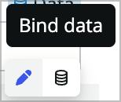

# Building a Killer Workspace Experience with UI Builder

## Goal

In this lab you will learn how to use UI Builder to build and configure a workspace for a custom application. You will start with a prebuilt application to manage a company's fleet of vehicles.

You will use UI Builder to open a starter workspace experience created from App Engine Studio to build out the fulfiller workspace experience to make it easier to interact with the application and make your fulfillers more productive. This lab will touch on a number of different parts of UI Builder while you create the custom experience including but not limited to:

* Creating lists
* Creating new pages
* Page parameters
* Data resources
* Client state parameters
* Client scripts
* Configuring components
* Using the repeater component
* Updating ServiceNow records from the experience
* Working with the Standard Record Page template

## Lab Objective

The primary objective of this lab is to expose you to the different parts of configuring and customizing a workspace. A very basic fleet vehicle management workspace exists in your instance and you will configure it similarly to how you would configure one of ServiceNow's default workspaces.

## (Optional) Pre-flight check

If you're doing this lab during CreatorCon, you'll be working on an instance on NowLearning loaded with the FLeet Vehicle Management application. If you're following along with this lab guide on a Personal Developer Instance (PDI), please follow the instructions in the Appendix at the end of this lab guide to learn how to pull in the Fleet Vehicle Management application.

# Exercise 1 - Basic Workspace Configuration

## Explore the base version of the app

1. In your instance, go to **Workspaces \> Fleet Vehicle Management**.

    You'll notice that the homepage is very generic and doesn't really fit our requirements, so you'll be adding a new variant and customizing that. 

1. Click on the list icon in the L1 menu on the left.

    

    Notice that the lists that come up on the left could be organized better, which we'll do.

1. Click into one of the requests.

    You'll notice the form that comes up just has the two tabs so we'll be enhancing that as well.

## Open the app in UI Builder

1. In the top menu in your instance, click **All**, type *App Engine* into the filter, and click **App Engine Studio** to launch *App Engine Studio*, or *AES* as we'll call it moving forward.

  The app currently consists of the following primary tables:

     * Vehicle
     * Maintenance requests
     * Maintenance tasks
     * Parts

1. Open UI Builder by clicking on the **Fleet Vehicle Management** workspace under *Experiences*.

  

  This will open the experience in UI Builder's experience view.

## Consolidate lists

In this section you'll do some consolidating of the lists in the workspace.

1. In the experience view choose the **List default** variant to open the list page in UIB.

1. Click on the **List nav** component to select it.

1. You'll see the config panel on the right side of your UIB page. Choose **Configuration** at the bottom. This will open the UX List Menu COnfigurations in a new tab. 
   
2. Choose **Fleet Vehicle Management_menu_config** to open the list configuration for this workspace experience.

3. In the related lists you'll see the 7 default menu categories and the 13 default lists. 

1. Use the **New** button to create a new UX List Category.

1. Give it the following values and choose **Submit**:

    * Title: Administration
    * Order: 1000

2. Click into **Maint req**, edit the following, and click **Update**:

    * Name: Maintenance Requests

2. Click into **Maint task**, edit the following, and click **Update**:

    * Name: Maintenance Tasks
    * Order: 200

1. Click into the **UX Lists** tab.

1. Use list editing to change the *Category* of each of the following UX Lists to **Administration** and the titles to match their table names:

    * Parts
    * Vehicles
    * Part reference
    * Manufacturers
    * Models

    

1. Now go back to the list view for the workspace from the previous exercise and do a refresh. You should see the new list structure.

## Configure the form

<!--The activity stream component shows up when you add the formatter to the form. Add the formatter, work notes, and comments to the form and see what happens. Then add the email client.-->

Now you'll do some form configuration. Since there is only one form view for our maint req table we don't have to worry about which form view we're using. If you're confgiuring the incident table or another table with multiple views you'll need to make sure you're editing the view that's being shown in the workspace. This generally set in the UX Page Properties for the experience, but could work differently in different workspaces.

1. If you still have the list page open, use the dropdown at the top to switch to the **Record page**.

<!-- update the page in the base app so it shows a maintenance request -->

1. Click **Open** at the top right to open the page in runtime in a new tab for testing. You'll see that it's missing the activity stream component and email functionality. Let's add it.

1. Back in your UI Builder tab, find and click on the **form** component.

    <!-- Insert screenshot -->

1. In the config panel on the right, click **Edit form view** to open table builder in a new tab.

1. At the top left, click **More** and choose **Formatters**.

    <!-- Insert screenshot -->

1. Add the **Avitivities (filtered)** formatter at the bottom of the form and choose **Save**.

1. Go back to the browser tab where the rendered record page is showing and hit refresh. You'll see that the activity stream now shows up on the right.

    > Note that there is a check on the workspace side of things that checks to see if the activity formatter is present and then shows the acitivty stream component if so. It doesn't matter where you add the activity formatter in table builder, it will always show in the same place on the UIB page unless you edit the UIB page and move it.

1. Notice that only work notes is accessible in the page. Go back to the table builder and add the additional comments field above the activities formatter.

1. Click save and refresh the rendered tab. You should now see the ability to post comments or work notes.

1. Now let's add email capabilities to the form. In table builder click **Preview**.

  <!-- Insert screenshot -->

1. In the view that comes up click **Open form in Platform** at the very top right.

  <!-- Insert screenshot -->

1. Right lick on the form header and choose **Configure > Dictionary**.

  <!-- Insert screenshot -->

1. Choose the dictionary entry without a column name where Type is Collection.

1. Click **Advanced view** under Related Links.

1. In the Attributes field add **email_client=true** and choose **Update** to save your changes.

1. In your rendered form tab refresh and choose the horizontal three dots menu to the right of the **Save** button. You should now see a *Compose Email* option.

# Exercise 2 - Enhance the experience home page

In this exercise you'll make a variant of the home page for a dispatcher persona that shows information about vehicles and allows the dispatcher to easily create requests. If you're working with one of the 20+ workspaces we ship by default, you'll notice that all of the pages associated are read only. If you want to change the appearance of the page you can create a variant of that page. You can duplicate the existing page or start from scratch, and we'll start from scratch here.

## Create a variant

A page variant in UI Builder is a variation of a page that exists at the same path that targets different audiences. Every page has a default variant.

1. Open UI Builder and go to the experience view for your FLeet Management Experience. If you're already in UIB, click Fleet Vechile Management next to the UIB logo at the left of the builder window.

2. Click on the plus sign next to Pages and variants.

1. Choose **Add variant to page**.

1. Choose **+Add variant** under *Home default*.

1. Choose **--> Create from scratch instead**.

2. Name it **Dispatcher home**.

3. Under *Audience* Click **+Add** anmd choose **Audience for appFleet Vehicle Management** and click **Create**.

4. Notice that the order of this variant is 0 so it will show up first. Click the **Editor** link for the *Dispatcher home* variant to open it in UIB.

## Add components to the page

1. Click back into the **Editor**.

1. Click **+Add component** under *Body (flex)* in the content tree to bring up the component toolbox.

    

2. Search for and choose **Container**.

    

1. Now you'll rename this container. I don't always rename components, but renaming containers is generally a good idea, especially when there will be a lot on the page. Click the **(i)** icon next to the name of the container on the right side of your builder window.

    

1. Give it a label of **Row 1** and an ID of **row_1** and click **Apply**.

    

1. Right-click on Row 1 (Flex) in the content tree and choose **Duplicate** or CMD/CTRL+D to duplcate the container.

    

1. Rename it **Row 2** and **row_2**.

1. Now add a **Row 3** the same way and **Save** your page (CMD/CTRL+S works for this). THe content tree should look like this.

    

1. Now add a **Stylized text** component in *Row 1*.

    

1. In the config panel on the right, choose **None Configure the component manually.**

1. In the *Text* property, enter: **Dispatcher Landing**

1. Now click on **Row 3 (flex)**.

1. In the styles panel choose **Grid** for the *Type* and fill out:

    * Gap: **Lg (1rem)**
    * Columns: **2**
    * Rows: **1**

1. Now add a **List - Simple** component to the Row 3 container. 
   
2. Rename the simple list component:

    * Label: Simple Request List
    * ID: simple_request_list

3. In the config panel, configure as follows:

    * Table: **Maint req**
    * Columns: **number | vehicle | mielage | state | short_description**
    * Edit filter: **State | is one of | Pending, Open, Work in Progress**
    * Maximum rows: **20**
    * Title: **Active Maintenance Requests**

4. Click the **Events** tab, choose **+ Add event mapping**, and choose **Reference link clicked**.

    

5. In the modal that comes up choose **Link to destination** under *Inherited event handlers*.

1. Choose the **Select destination** button, expand the *Pages* dropdown, and choose **Record**.

1. Now you'll need to pass in dynamic data to the event handlers properties. Mouse over the *table* property and click the **Bind data** icon.

    

1. Set the value to **@payload.table**

1. Do the same with the sysId property and set the value to **@payload.sys_id**.

1. Click **Add** to add the event handler to the event.

1. Save the page and open the preview. Both the requests and vehicle links should open the appropriate records.

1. Now right-click on the **Simple Request List** component in the content tree and choose **Duplicate**.

1. Rename the component **Simple Vehicle List** and **simple_vehicle_list**.

1. Configure the component as follows:

    * Table: **Vehicle**
    * Columns: **number | vehicle_name | mileage | next_oil_change | next_tire_rotation**
    * Edit filter: **Next oil change | on | This quarter OR Next tire rotation | on | This quarter**
    * Title: **Vehicles this quarter**

## Add vehicle search box

Now you're going to add a vehicle search to the homepage so the dispatcher can easily search vehicles by name or license plate.

1. Inside the empty *Row 2* container, add another Container component and call it **Search container**

2. Add another container by right-clicking on the Search container and choosing **Add component after**. Call it **Vehicle container**.

1. Open the client state parameter panel by clicking the **Client state** icon in the bottom left corner of the builder window.

    > Client state parameters are how you can manage the page's state. You can think of these as the page's scratchpad where you can store values to be used elsewhere on the page.

1. Use the **+Add** button to add a new client state parameter:

    * Name: searchTerm
    * Type: String
    * Initial value: <empty>

2. Now you'll add a search component and set the client state parm value when someone searches. Inside the *Search container* add a **Search input** component and set its Placeholder property to **Search vehicles**.

3. Click into the *Events* tab, choose **+Add event mapping**, and then choose **Search executed**.

4. On the left, under *Page-level event handlers* choose **Update client state parameter** and fill out the form:

    * Client State Parameter Name: searchTerm
    * New Value: (change to dynamic data binding) @payload.searchTerm

1. Click **Apply**.

1. You're going to display search results inside the Vechile container, but first you're going to show/hide that container based on whether the searchTerm parameter is empty or not. Click on the **Vehicle container (flex)** in the content tree.

1. In the config panel for the container on the right, there is a very small eye icon at the top right of the panel that toggles the component visibility properties. Click it.

    

1. Mouse over the *Hide component* property and switch to dynamic data binding.

    

1. Now, you'll use a formula in that property. Enter **EMPTY(@state.searchTerm)**. This formular returns true/false based on whether the *searchTerm* client state parameter is empty or not.

1. **Save** the page and open it in the runtime. Type something into the search box and hit enter. You should see the container show up with the no contents displayed error message once you execute a search.

## Add vehicle search results

Now you'll configure the search results. You're going to use a data resource and repeater rather than another list component to expose a different method of showing a list of records. 

1. First you'll need a data resource. Click the data icon at the bottom left of the page.

    

1. In the Data panel that comes up, choose **+Add**, search for **look up records**, choose the **Look up records** data resource and click **Add**.

    

1. Fill out the data resource as follows:

    * Use the (i) to change the label to **Look Up Vehicles** and the ID to **look_up_vehicles**.
    * When to evaluate this data resource: Only when invoked (explicit)
    * Table: Vehicle
    * Edit conditions: **Vehicle name | contains | <ddb> @state.searchTerm** OR **License plate | contains | <ddb> @state.searchTerm**
    * Return fields: **Vehicle name | license_plate**
    * Order by: Vehicle name
    * Max results: 10

1. Since you selected that the data resource is only evaluted when invoked, you'll need to trigger a refresh when someone searches. Click into the **Search input 1** component, click on its events tab, and add another event handler to the *Search executed* event.

1. Under *Look up vehicles* choose **Refresh** and click **Add**.

2. Now add a new container component within the Vehicle container and set it to:

    * Component label: (click the i icon) List header container
    * Type: Grid
    * Columns: 3
    * Rows: 1
    * Padding: Lg (1rem)

3. Add a stylized text component within the container component and fill it out:

    * Text: Vehicle name
    * HTML tag: H2

4. Duplicate the stylized text component you just added and set the text to **License plate**.

5. Right-click **List header container (Grid)**, choose add component after, and add a **Repeater** component.

6. In the Repeater's config panel, change the *Data array* property to dynamic data binding and enter: @data.look_up_vehicles.results. You should see a little green 10 next to the repeater component in the content tree since you're returning 10 results from the data resource.

7. Add another **Container** inside the repeater calling it **List container** and styling it the same as the *List header container* from the last step.

8. Within that container add a stylized text component with the following values:

    * Text: **@item.value.vehicle_name.value**
    * HTML tag: **H4**

9.  Duplicate that stylized text component to another and give it text of: **@item.value.license_plate.value**

10. Add a **Buton** component after the stylized text component with the following values:

    * Label: **Create New Maint Request**
    * <click into styles tab> Padding: **Lg (1rem)**

11. In the *Events* tab add a new event handler to the *Button clicked* event.

12. Choose **Link to destination** and change the *Mode* from *Form* to **Script**.

    

13. You'll paste the following script from [Exercise2.txt](files/Exercise2.txt):

    ```javascript
    /**
    * @param {params} params
    * @param {api} params.api
    * @param {any} params.event
    */
    function evaluateEvent({api, event}) {
        return {
            route: 'record',
            fields: {
                'table': 'x_snc_flt_mgmt_maint_req',
                'sysId': -1
            },
            params: {
                'query': 'vehicle=' + api.item.value._row_data.uniqueValue
            },
            redirect: null,
            passiveNavigation: null,
            title: null,
            multiInstField: null,
            targetRoute: null,
            external: null
        };
    }
    ```

    > You're using a script for this in order to build the query param. You can pass a query to the record page to prepopulate values, similar to the classic environment.

14. Click **Apply** and **Save** the page.

15. Open the page in the runtime and test it. Search for a Ford Mustang and click the **Create New Maint Request** button. It should open the request in a new tab while prepopulating the vehicle record in the request.

This isn't the prettiest page in the world, and maybe even isn't all that practical, but hopefully it gives you an idea of some of what you can accomplish on a landing page like this. 

## Do some styling?

<!-- Have to wait until Patch 2 is avails -->

# Exercise 3 - Enhance the Record Page for Vehicles

The next requirement is to customize the vehicle record page and give it an overview tab. Right now there is just one generic record page variant, so you'll create a new variant specifically for vehicles and edit that.

## Create a variant for Vehicles

1. Using the page picker dropdown, open the **Record** variant of the record page.

    

2. Use the hamburger icon at the top left of the page and choose **Duplicate variant**.

    

3. Name it **Vehicle Record**, set the conditions to **table=x_snc_flt_mgmt_vehicle**, and choose **Create**.

4. Click the **Settings** toggle at the top of the builder window, change the *Order* to **-10**, and **Save**.

## Add an overview tab to the variant

Now you'll add an overview tab to this page showing an over view of the record so you don't need to click into the details or related lists unless something needs to be updated.

1. In the content tree, click **Main Tab**.

1. In the Config panel, click **+Add** next to the Tabs property.

    

1. Choose **Start from an empty container** and click **Next**.

    > If this was a tab we wanted to reuse on another page we might use a page collection instead which allows you to create a subpage which can be used in other tabsets.

2. Label it **Overview**, choose **No icon**, and click **Create**.

2. Back in the Config panel of the Main Tab component use the 2x3 vertical dots icon to drag the **Overview** tab above the *Details* tab.

    

3. In the content tree on the left, add a new container component to the *Overview (Flex)* tab under the *Main Tab* and label it **Vehicle Info**. Set its styles as follows:

    * Type: **Grid**
    * Columns: **2**
    * Rows: **1**

4. Duplicate that container and call the new one **Related Record Info**.

1. In the Vehicle info container, add an **Image** component.

1. It's going to try to use the record controller, but we want to feed it other data than it's expecting, so at the top of the config panel change the dropdown to **None**.

    

1. Choose **Remove** in the popup.

1. Set the *Image source* property to **@data.record.form.fields.image.displayValue**. This is data that is already being served to the page, since the image field is on the vehicle form already.

1. Right click on the Image component in the content tree and add a **Container** component after it.

1. Configure the container as follows:

    * Type: **Grid**
    * Columns: **2**
    * Rows: **1**
    * Padding: **Lg (1rem)**

1. Add a stylized text component in the container and remove the preset like you did with the image component and then configure it:

    * Text: *Mileage**
    * HTML Tag: **H2**

2. Duplicate the stylized text component and change the text property to: **@data.record.form.fields.mileage.displayValue**

1. Now do the same thing with 4 more stylized text components for: 

    * Next Tire Rotation: @data.record.form.fields.next_tire_rotation.displayValue
    * Next Oil Change: @data.record.form.fields.next_oil_change.displayValue

    Your container grid should look something like this:

    

    And your page should look something like this (possibly with different values/vehicle):

    

2. **Save** the page and preview it. Does your overview tab show up?

3. Now you're going to add a custom GraphQL data resource to return data about the related records so you can give a real overview of the history of the vehicle on the overview tab. Open the **Data** panel. 

4. Click **+Add**, search **get vehicle**, choose **Get Vehicle Info GQL**, and click **Add**.

    

5. In the data resource properties, set the *Vehicle SysID* property to **@context.props.sysId**.

    

    > Note: If you're curious about GraphQL, this application has an enitre GraphQL API setup for it and this data resource does one API call that easily grabs data from four different tables in a very performant way.

6. Add two containers, one after the other, within the *Related Record Info* container. Name them the following:

    * Maint requests (maint_requests)
    * Parts (parts)

    

7. Now you will build out a list of requests and their respective tasks. In the *Maint requests* container, add a stylized text container.

1. Use the preset dropdown to remove the preset and set the text property to: **Maintenance Requests**.

1. Add a repeater component after the stylized text.

1. Change the *Data array* property to dynamic data binding and then set it to: **@data.get_vehicle_info_gql_1.output.data.xSncFltMgmt.fleet.vehicle.maintReqs**. This should give you a 2 in the green label next to the repeater component.

1. Click into the styles tab for the repeater and click **Enable styles**. This turns the repeater into a container.

2. Add a stylized text component within the repeater. You're going to use a formula to set this stylized text in order to simplify things a bit.

1. Switch the *Text* prop to dynamic data binding and then use the CONCAT formula to pull in multiple values: **CONCAT(@item.value.number, ": ", @item.value.shortDescription)**. Set the *HTML tag* to **H3**.

1. Add a **Repeater** component after the stylized text component within the existing repeater.

    > Now you're going to display tasks within the requests. This is really where you start to see the value of having an overview tab like this. You get fields and related records by default, but if your data model is a little more complex than that it's going to involve a lot of clicking. Also, many times when someone navigates to a form they really only need to take a look at the record rather than updating anything. This lets you display lots of information for that type of person without cluttering up the actual form.

2. Set the *Data array* prop to **@item.value.maintTasks**.

1. Click into the styles tab and add the following to the CSS styles:

    ```css
   * {
       margin-left: 3rem;
   }
    ```

2. Add a stylized text component within the repeater.

3. Switch the *Text* prop to dynamic data binding and then use the CONCAT formula again: **CONCAT(@item.value.number, ": ", @item.value.shortDescription)**. Set the *HTML tag* to **H4**.

1. Save and test the page.

    > You could make these requests and tasks clickable or add an open button next to them, but in the interest of time we won't be doing that here.

## Challenge section

You've listed Maintenance requests and tasks in the left column, so try doing the same thing for **Parts** in the right column of the *Related Record Info* container. This one will only have one level as the parts table does not have a child relationship.

# Exercise 4 - Create actions and buttons

## Add a close task button

Create a UI Action and associate it with the table

## Open a new request from the overview tab

# Exercise 5 - Miscellaneous

## 

## Do something with UX Page Properties to show how they work

Add an arbitrary one and then call it from multiple pages. Maybe some JSON?

## Record watcher

## User experience analytics

# Challenge Exercise